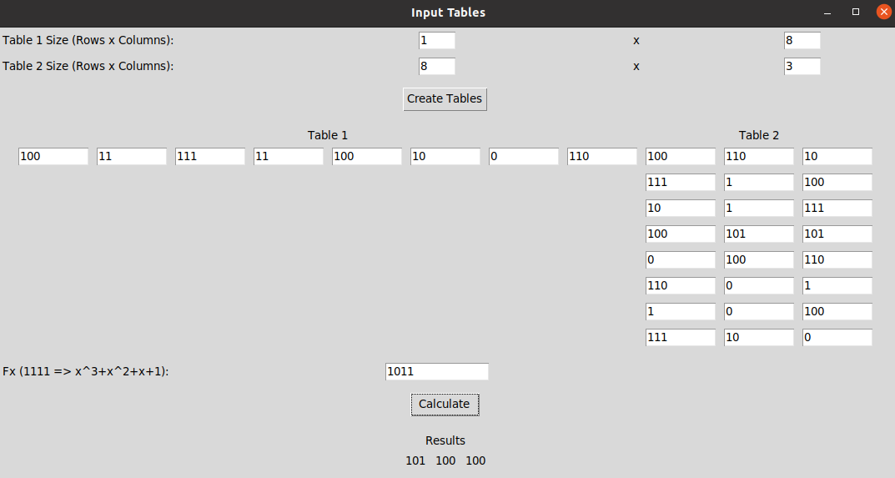

# Task to solve matrix 
## Base formula
### E(m) = (r,m)Ga,b&oplus;ε

<code>(r,m)</code> - **Open text** 📜

<code>Ga,b </code>- **Closed key** 🔑

## Input
> Table1 size **(r,m)**

> Table2 size **Ga,b**

> Table1

> Table2 

> f(x) = $x^3+x+1$
## Example calculation

